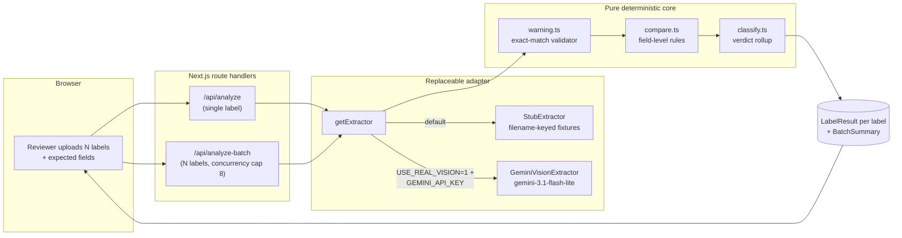

# Treasury TTB — Alcohol Label Verification Prototype

A reviewer-facing tool that ingests alcohol-beverage label images alongside the applicant's expected product facts, runs vision-model extraction, and returns a Pass / Needs Review / Fail verdict per label with a full audit trail. Batch-first: agents upload an entire submission queue, the system processes everything automatically, and only the **exception queue** needs human eyes.

*Built for the IT Specialist take-home at the U.S. Department of the Treasury (TTB).*

---

## Live demo

- **Deployed app:** https://treasury-takehome.vercel.app/
- **Repo:** `hegstadjosh/treasury-label-verification` (private; reviewer access by invite)

The deployed app runs against the real Gemini API behind a `USE_REAL_VISION=1` flag. Locally and in CI, a deterministic `StubExtractor` runs instead so tests are free and free-of-network.

---

## Table of contents

1. [What this is](#what-this-is)
2. [Approach & design choices](#approach--design-choices)
3. [Architecture](#architecture)
4. [How a label is judged](#how-a-label-is-judged)
5. [Tech stack](#tech-stack)
6. [Running it](#running-it)
7. [Test strategy (three tiers)](#test-strategy-three-tiers)
8. [HTTP API](#http-api)
9. [Trade-offs & known limitations](#trade-offs--known-limitations)
10. [What a production version would add](#what-a-production-version-would-add)
11. [Repo layout](#repo-layout)
12. [Acknowledgements](#acknowledgements)

---

## What this is

TTB reviews ~150,000 alcohol label applications a year. The current workflow is mostly visual matching — the agent opens the application, pulls up the label artwork, and verifies that what's printed matches what was declared: brand name, class/type, ABV, net contents, and the canonical 27 CFR §16.21 government warning. The deputy director describes "half our day doing what's essentially data-entry verification."

This prototype is the **assistant** that handles the routine matching. Reviewers upload a batch of labels (and the associated expected facts — either one declared set that applies to every label, or a per-label CSV when the batch is many different products from one importer); the system extracts the visible label text with a vision model, runs a deterministic comparison against each label's claims, and produces:

- An **overview** — Pass / Needs Review / Fail / Unreadable counts
- A **filterable queue** of every label with its verdict and top reason
- A **drill-down** per label with the full audit trail: expected vs. extracted per field, the model's raw text, its confidence and quality notes

The judgment call (Pass / Needs Review / Fail / Unreadable) is made by **deterministic application code**, not by the model. The model's job is bounded to extracting text. This keeps the rules auditable and means swapping the model later doesn't change the rules.

## Approach & design choices

Four decisions drove the architecture:

**1. Pure deterministic core, model only at the edge.** The comparison and verdict logic (`src/lib/{warning,compare,classify}.ts`) is plain TypeScript with no I/O. The vision model only produces a structured `ExtractedLabel`. This means:
- The rules are exhaustively unit-testable without burning API budget
- The model is replaceable behind a `VisionExtractor` interface (Gemini today, Azure Document Intelligence tomorrow, fine-tuned model the day after)
- Changes to the rules don't require re-prompting or re-evaluating the model

**2. Government warning is the strictest rule.** From the Jenny Park interview: the warning has to match TTB's canonical text **verbatim**, including the all-caps `GOVERNMENT WARNING:` prefix. Title-case "Government Warning" is an automatic reject. Other fields are forgiving on case, punctuation, and unit notation (`750 mL` = `750ml` = `0.75L`); the warning is not. That asymmetry is enforced in the comparison rules, not in the model prompt.

**3. Autonomous-first, exception-driven review.** Per the build plan: the system makes the decision; the reviewer's role is to drill into the exception queue. Most labels never need a human glance. This shaped the UX — the **batch overview** is the home screen, not a stretch goal, and Fail / Needs Review / Unreadable rows surface at the top of the queue by default.

**3a. Two batch modes for two real workflows.** Sarah Chen's interview names two pain points: (i) "big importers who dump 200, 300 label applications on us at once" — every label a different product with its own expected facts — and (ii) the small case where one product gets reviewed across multiple photos or design iterations. The app supports both via a mode toggle:
- **Same for all** — one declared-fields form applies to every uploaded label. Right for same-product runs.
- **Per-label CSV** — reviewer uploads a CSV mapping each filename to its OWN expected fields, then drops in the matching images. Right for the importer-batch case. In a future COLA integration, the same `expectedByFilename` map would be auto-populated from the application records — the CSV is the believable production seam for an offline prototype.

**4. Three-tier testing.** Pure-core unit tests (fast, deterministic, exhaustive) → integration tests against the route with a `StubExtractor` (no API spend) → one gated live smoke test against the real Gemini API (run before submitting, never in CI). Each tier earns its keep; nothing duplicates.

## Architecture



The seam between the **replaceable adapter** and the **pure deterministic core** is the central engineering decision. The adapter only produces an `ExtractedLabel` — the core does everything else. Tests run the core end-to-end with the `StubExtractor` and never touch the network.

## How a label is judged

For each of the five tracked fields, the comparison rule is documented and tested:

| Field | Rule | Source |
|---|---|---|
| `brand_name` | Case-insensitive, punctuation-normalized, trim whitespace | Build plan: "Be forgiving on obvious casing/punctuation differences" |
| `class_type` | Case-insensitive, punctuation-normalized | Same |
| `alcohol_content` | Numeric parse, compared as a percentage within ±0.05% absolute tolerance | Trade tolerance most TTB applicants are used to |
| `net_contents` | Canonicalize to milliliters (`mL`/`ml`/`L`/`cL`/`fl oz`/`oz`), compare with 0.1% relative epsilon | Handles unit-notation variance without false positives |
| `government_warning` | **Strict.** All-caps `GOVERNMENT WARNING:` prefix required; canonical 27 CFR §16.21 wording required; whitespace forgiving (real labels wrap mid-sentence) but punctuation and word choice are not | Cross-verified against Cornell LII + GovInfo CFR XML |

Each field produces a `FieldResult { expected, extracted, verdict, reason }`. The label-level verdict is then a precedence rollup:

```
any field Fail        → label Fail
else any Needs Review → label Needs Review
else                  → label Pass
```

`Unreadable` is a separate verdict reserved for **extractor failure** — the model crashed, timed out, returned non-JSON, or was safety-blocked. Unreadable labels still appear in the queue (the agent re-uploads with a clearer photo); they aren't surfaced as transport errors.

## Tech stack

- **Next.js 16** (App Router) on **Vercel**
- **React 19**, **TypeScript** strict, **Tailwind 4**
- **Vitest** for unit + integration tests, `@vitest/coverage-v8` for coverage
- **Zod** for runtime schema validation of request payloads
- **Google Gemini API** (`gemini-3.1-flash-lite` — the current fastest Flash-tier model with structured JSON output + image input as of May 2026)
- No model SDK dependency — direct `fetch` against the Gemini REST endpoint with `responseMimeType: "application/json"` and a strict `responseSchema`, so we get back valid JSON without parsing prose

The choice to skip the official `@google/generative-ai` SDK was deliberate. The REST surface for image-input + structured-output is small enough that adding a 200KB dependency for one call is unjustified, and a direct `fetch` keeps the code straightforward to swap to another provider.

## Running it

**Prerequisites:** Node 20+, npm 10+.

```bash
git clone https://github.com/hegstadjosh/treasury-label-verification
cd treasury-label-verification
npm install
```

### Dev server (uses StubExtractor — no API key, no spend)

```bash
npm run dev
# open http://localhost:3000
```

The home page has two batch modes (toggle at the top of step 2 on the page):

- **Same for all** — one ExpectedLabel form, applied to every uploaded image. Best for same-product runs.
- **Per-label CSV** — upload a CSV mapping `filename → expected fields`. The app validates the CSV up front, matches each image to its row by filename (case-insensitive), and blocks the Analyze button if any image is unmatched. Best for multi-product importer batches.

CSV format (header row required):

```csv
filename,brand_name,class_type,alcohol_content,net_contents,government_warning_required
ok.png,Old Tom Distillery,Straight Bourbon Whiskey,45% ABV,750 mL,true
"vineyard.png","Crisp Vineyards","Cabernet Sauvignon","13.5% ABV","750 mL",true
```

The parser handles RFC-4180-style quoting (commas inside quoted fields, escaped `""` quotes). `government_warning_required` is optional (defaults to `true`).

In dev mode, image uploads route through the `StubExtractor`, which keys off the **filename** (case-insensitive, extension-stripped) to return one of five canned extraction outputs:

| Filename | Result |
|---|---|
| `ok.png` (or anything not matching below) | All fields Pass |
| `abv-mismatch.png` | ABV doesn't match the expected value → Fail |
| `missing-warning.png` | No government warning extracted → Fail |
| `lowercase-warning.png` | Warning has title-case `Government Warning:` → Fail |
| `low-quality.png` | Notes + low per-field confidence → Needs Review |

You can drop any image renamed to these and exercise the full verdict matrix without spending a cent. (The image content doesn't matter — the stub doesn't read pixels.)

### With the real Gemini extractor

```bash
export GEMINI_API_KEY=...
export USE_REAL_VISION=1
npm run dev
```

**Both** flags must be set. Either alone falls back to the stub. This was a deliberate ergonomic choice — it makes accidentally hitting the live API in CI impossible.

### Production deploy (Vercel)

The repo is wired to Vercel via `vercel.json` + the Vercel CLI. Env vars (`GEMINI_API_KEY`, `USE_REAL_VISION=1`) are set on the project's production environment. Push to `main` and run `vercel --prod` to deploy.

## Test strategy (three tiers)

```bash
npm test         # unit + integration, fast, no API spend  (102 tests)
npm run test:live # unit + integration + LIVE Gemini smoke (RUN_LIVE_TESTS=1, ~15s for 2 calls)
npm run check    # lint + test + production build, what CI would run
```

**Tier 1 — Pure-core unit tests** (`src/lib/{warning,compare,classify}.test.ts`, 53 tests)
- Exhaustive coverage of the deterministic rules. No mocks, no fixtures — pure inputs and outputs.
- The government warning validator has the densest coverage: exact match passes, lowercase prefix fails, missing fails, paraphrased fails, internal punctuation strict, whitespace forgiving.
- These tests run in **~120 ms**. They are the safety net under every other layer.

**Tier 2 — Integration tests** (`src/app/api/**/*.test.ts` + `src/lib/{vision,csv}.test.ts`, 49 tests)
- Exercise the HTTP routes end-to-end with the `StubExtractor` injected. The route handler, multipart parsing, zod validation, classifier rollup, and JSON response shape are all covered without touching the network.
- The batch route includes a **concurrency probe** that submits 20 images and asserts peak inflight extractor calls never exceeds the cap (8) and is greater than 1 (i.e. it actually fans out).
- Filename-keyed stub fixtures let one test file generate a mixed-verdict batch deterministically.
- The per-label CSV path is independently covered: 16 CSV-parser tests (RFC-4180 quoting, case-insensitive filename match, duplicate detection, header validation, trailing-blank tolerance) and 7 new batch-route tests for `expectedByFilename` (happy path with mixed expected sets, case-insensitive filename match, 400 listing unmatched filenames, the "either-but-not-both" enforcement, empty-CSV rejection).

**Tier 3 — Live smoke test** (`src/lib/vision.live.test.ts`, 2 tests, gated by `RUN_LIVE_TESTS=1`)
- Runs the real `GeminiVisionExtractor` against the canonical `OLD TOM DISTILLERY` fixture (AI-generated, but with all five required fields rendered crisply).
- Asserts the extraction shape is correct and the end-to-end pipeline classifies the matching `ExpectedLabel` as Pass.
- Run this before deploying. Not part of CI — burns API budget, depends on the live service.

Coverage report: `npx vitest run --coverage`.

## HTTP API

### `POST /api/analyze` — single label

**Request** (`multipart/form-data`):
- `image` — the label image file (PNG / JPG)
- `expected` — JSON-encoded `ExpectedLabel`:
  ```json
  {
    "brand_name": "OLD TOM DISTILLERY",
    "class_type": "Kentucky Straight Bourbon Whiskey",
    "alcohol_content": "45% Alc./Vol. (90 Proof)",
    "net_contents": "750 mL",
    "government_warning_required": true
  }
  ```

**Response 200** — `LabelResult` JSON:
```ts
{
  verdict: "Pass" | "Needs Review" | "Fail" | "Unreadable",
  fields: Array<{
    field: "brand_name" | "class_type" | "alcohol_content" | "net_contents" | "government_warning",
    expected: string,
    extracted: string,
    verdict: "Pass" | "Needs Review" | "Fail",
    reason: string
  }>,
  top_reason: string,         // empty for clean Pass
  extracted: ExtractedLabel    // raw model output for the audit panel
}
```

**Response 400** — `{ error: string }` for malformed request (missing image, missing/invalid expected, schema-invalid expected).

**Response 500** — reserved for unexpected programming bugs. Extractor failure does **not** produce 500; it produces 200 with `verdict: "Unreadable"`.

### `POST /api/analyze-batch` — many labels

**Request** (`multipart/form-data`):
- `image` — append once per file (`form.append("image", file)` for each). Server reads via `form.getAll("image")`.
- **Exactly one of:**
  - `expected` — one JSON-encoded `ExpectedLabel` applied to every image in the batch (same-product mode).
  - `expectedByFilename` — JSON-encoded `Record<string, ExpectedLabel>` keyed by image filename (case-insensitive). Every uploaded image must have a matching row, otherwise the route returns 400 listing the unmatched filenames.

If both `expected` and `expectedByFilename` are present, the route returns 400. This is intentional — the two modes are mutually exclusive and silently picking one would be a footgun.

**Response 200** — `BatchAnalyzeResponse`:
```ts
{
  labels: Array<{
    id: string,        // `${index}-${filename}`, stable & unique
    filename: string,
    result: LabelResult
  }>,
  summary: {
    total: number,
    pass: number,
    needs_review: number,
    fail: number,
    unreadable: number
  }
}
```

`labels` is returned in **upload order**, not completion order, so a client can confidently use `id` as a React key without rows jumping.

Concurrency: extractor calls fan out with a cap of **8** simultaneous inflight requests (`BATCH_CONCURRENCY` in `src/app/api/analyze-batch/route.ts`). This sits comfortably inside the Gemini per-project QPS budget while still hiding per-label latency under parallelism.

## Trade-offs & known limitations

I want these to be visible up front — a prototype's value is partly in being honest about what it doesn't do yet.

### Latency

The stakeholder interview was explicit: **"If we can't get results back in about 5 seconds, nobody's going to use it."** They mentioned killing a prior vendor pilot for being too slow.

Measured warm latency for `gemini-3.1-flash-lite` (the current fastest Flash-tier model with structured-output + image-input support) on a ~1 MB image is **~7–9 seconds** per call. End-to-end through this app's deployed Vercel route the canonical fixture round-trips in **~5.8 s**. That's right at the edge of the budget but not comfortably under it.

This is acknowledged, not solved, in this prototype. The mitigation paths are listed in [What a production version would add](#what-a-production-version-would-add). The batch UX hides per-label latency under fan-out — reviewing 50 labels takes ~50 s of model time, not 50 × 8 s, because of the concurrency cap.

### State is in-memory only

Batch state lives entirely in the browser. Reload = batch lost. Drill-down is a side sheet, not a separate route, because there's no server-side store to rehydrate from. A production version would persist results (server-side session, Postgres, S3) so reviewers could resume later and share queue links.

### No authentication

Anyone with the URL can POST images and get extraction results. Acceptable for a prototype; would be the first thing to add for production.

### No upload size limits

Neither the client nor the server enforces a per-file or per-batch byte cap. Adversarial 100 MB uploads will land on the function and waste memory. For a stakeholder demo this is fine; for any public deployment, the first hardening pass would add a 10 MB per-file client check and a server-side multipart size guard.

### Vercel body limit on very large batches

Vercel's serverless function default body limit is ~4.5 MB. Sarah Chen's interview describes peak-season dumps of 200–300 label applications at once; at typical phone-photo sizes (~1–4 MB per JPG) that exceeds the body limit in a single request. The current batch UI works around this with **client-side chunking** — it sends the batch to `/api/analyze-batch` in chunks of 8 labels per request, merges results client-side, and surfaces incremental progress. That's good enough for the prototype's expected demo loads and is documented inline in `src/app/page.tsx`. A production version would either bump the body limit, switch to direct S3 / Azure Blob uploads with signed URLs and pull-by-reference extraction, or use a chunked-upload protocol.

### TTB COLA integration is out of scope

The take-home brief is explicit that this is **a standalone proof-of-concept**, not a COLA integration. There's no application-ID lookup, no FedRAMP-anything, no procurement plumbing. This is "could this approach work" code, not "could this ship into production today" code.

### Government infrastructure realities

From the Marcus Williams interview: TTB's network blocks outbound traffic to many cloud ML endpoints. A real production version would need to either route through an approved Azure OpenAI deployment, run inference inside the TTB network boundary, or use Azure Document Intelligence (which already has the FedRAMP authorization). The `VisionExtractor` interface is precisely the seam where that swap happens.

### Image quality handling

If the model reports low confidence or notes image issues, those surface in the audit panel — but the UI doesn't currently push a label into `Needs Review` just because confidence is low. That's a deliberate iter-3 deferral: rolling confidence into the verdict is a UX-and-policy decision (what threshold? does it override a clean Pass?) that the spec didn't pin down. The extracted `confidence` and `notes` are pass-through so a future iteration can layer that in without changing the extraction contract.

## What a production version would add

In rough priority order:

1. **Swap the extractor to a FedRAMP-authorized service.** `GeminiVisionExtractor` becomes `AzureDocumentIntelligenceExtractor` (or `AzureOpenAIExtractor`) implementing the same `VisionExtractor` interface. No route or core code changes.
2. **Image preprocessing.** Downscale to ≤1200px max dimension before sending. Most label photos are 3000–5000 px tall and that uploads slowly without improving OCR. A simple `sharp` pipeline saves 30–50 % of network time per call.
3. **Persistence.** Postgres or DynamoDB for batch state; S3 (or Azure Blob) for the source images. Queue results survive reload, reviewers can resume, and audit trails are durable.
4. **Authentication.** TTB SSO via Azure Entra ID. Per-reviewer activity logging.
5. **Confidence policy.** Codify: "If extracted confidence on any field is below X, mark Needs Review." That's a policy decision — surface the threshold as a config, not a constant.
6. **COLA integration.** Pull the expected fields from the application record automatically instead of having the reviewer retype them. This is the high-value integration but per Marcus's interview it's a multi-year procurement effort, not a prototype concern.
7. **Multi-language warnings.** Imports have non-English text. The TTB warning is English-only by regulation, but other label text isn't.
8. **Adversarial-input hardening.** Request size limits, MIME validation, magic-byte verification, defenses against zip bombs and image-decoder vulnerabilities. The prototype trusts uploads.
9. **Observability.** Per-extractor latency histograms, model-failure rate, verdict distribution drift, per-reviewer queue throughput.
10. **Caching of identical labels.** Same image bytes + same expected = same result. A content-addressed cache cuts re-review cost.

## Repo layout

```
treasury-takehome/
├── src/
│   ├── lib/
│   │   ├── types.ts                  # Field, ExtractedLabel, ExpectedLabel, LabelResult, …
│   │   ├── warning.ts                # canonical 27 CFR §16.21 validator (pure)
│   │   ├── warning.test.ts           # 17 unit tests
│   │   ├── compare.ts                # field-level comparison rules (pure)
│   │   ├── compare.test.ts           # 26 unit tests
│   │   ├── classify.ts               # Pass/Needs Review/Fail rollup (pure)
│   │   ├── classify.test.ts          # 10 unit tests
│   │   ├── vision.ts                 # VisionExtractor interface, StubExtractor, GeminiVisionExtractor
│   │   ├── vision.test.ts            # stub unit tests
│   │   ├── vision.live.test.ts       # GATED live smoke test (RUN_LIVE_TESTS=1)
│   │   ├── extractor-factory.ts      # selects Stub vs Gemini based on env
│   │   ├── batch.ts                  # order-preserving mapWithConcurrency helper
│   │   ├── csv.ts                    # RFC-4180-ish CSV parser + expectedByFilename mapper
│   │   └── csv.test.ts               # 16 parser unit tests
│   ├── app/
│   │   ├── page.tsx                  # batch home (overview + queue + drill-down)
│   │   ├── layout.tsx
│   │   ├── globals.css
│   │   └── api/
│   │       ├── analyze/route.ts
│   │       ├── analyze/route.test.ts
│   │       ├── analyze-batch/route.ts
│   │       └── analyze-batch/route.test.ts
│   └── components/
│       ├── MultiUploadZone.tsx       # drag/drop multi-file with thumbnails
│       ├── ExpectedFieldsForm.tsx    # batch-wide expected-fields form
│       ├── OverviewTiles.tsx         # 4 verdict-count tiles, clickable to filter
│       ├── QueueTable.tsx            # filterable, sortable label list
│       ├── LabelDrillDown.tsx        # side sheet wrapping ResultPanel
│       ├── ResultPanel.tsx           # verdict badge + audit table + evidence panel
│       ├── VerdictBadge.tsx          # colored sm/md/lg badge
│       └── UploadZone.tsx            # single-file upload (used in earlier iter, kept for reuse)
├── test-fixtures/
│   └── labels/
│       └── old-tom-distillery.png    # canonical happy-path fixture (AI-generated)
├── AGENTS.md                          # conventions for any AI agent (or human) editing this repo
├── README.md                          # you are here
├── package.json
├── next.config.ts
├── vitest.config.ts
└── tsconfig.json
```

## Acknowledgements

- The canonical `OLD TOM DISTILLERY` test fixture at `test-fixtures/labels/old-tom-distillery.png` is AI-generated via Google's Nano Banana Pro (`gemini-3-pro-image-preview`) using the example label fields from the take-home brief. It was generated specifically so the live smoke test has a known-good real image to round-trip without scraping any real applicant's label artwork.
- The 27 CFR §16.21 government warning canonical text was cross-verified against Cornell Legal Information Institute and GovInfo's CFR XML feed before being baked into `warning.ts`. TTB.gov was timing out at the time of writing.
- Built across roughly four hours of focused work on the day of the deadline. The atomic commit history reflects the actual iteration order, not a post-hoc rewrite.

